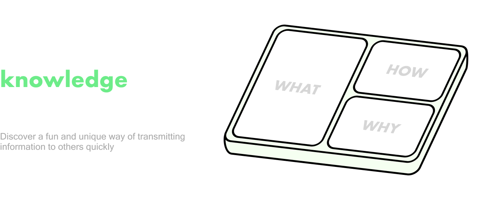

## TinyBento

### Terminology

High-level:

- `TinyBento` - Our app!
- `Bento` - The single box that holds everything. Has dimensions, width, height, etc.

Drag and Drop Components (dndkit):

- `DroppableBentoSquare` - A single square in the bento that can hold an ingredient. There are (width x height) of these in a bento
- `DraggableIngredient` - An ingredient that can be dragged and dropped into a DroppableBentoSquare

Interfaces:

- `Ingredient` - A single item contained in the bento. Can have one of many variants:
  - `DroppedIngredient` - A type of ingredient that has been dropped into the bento
  - `PreviewIngredient` - A type of ingredient that is being dragged around the screen
