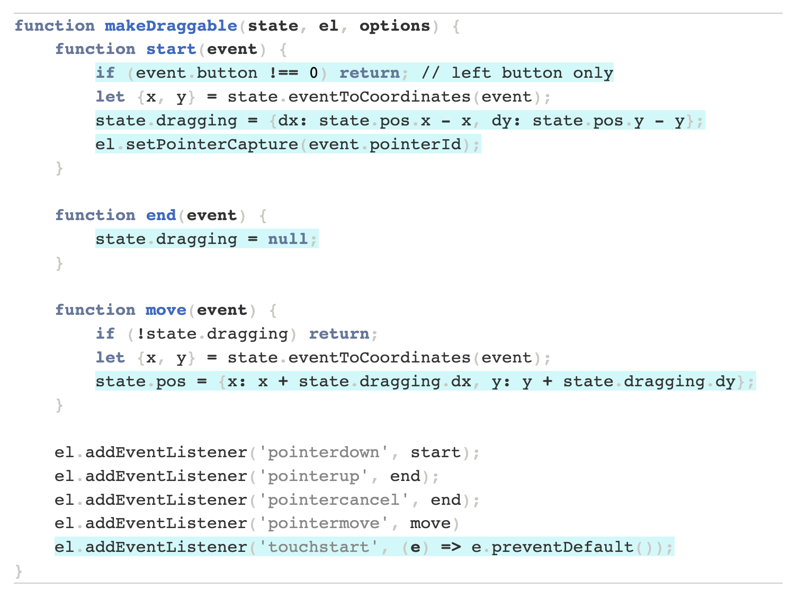

# Dragging Algorithm

## Table of Contents

- [Definitions](#definitions)
  - [Draggable](#draggable)
- [Props](#props)
  - [Draggable](#draggable-1)

### Definitions

#### Draggable

**What?**

**How?**
To wrap a `<ChildComponent />` in a Draggable component, use the following syntax:

```tsx
<Draggable>
  <ChildComponent />
</Draggable>
```

The `<Draggable />` component accepts the following props ([See Here](#Draggable-1))

**General Strategy:**

Source: https://www.redblobgames.com/making-of/draggable/

**Why?**

### Props

#### Draggable

| Prop Name | Type | Description |
| --------- | ---- | ----------- |
